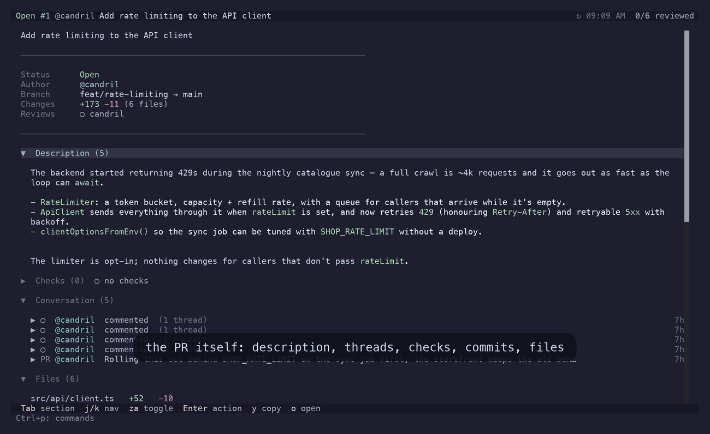
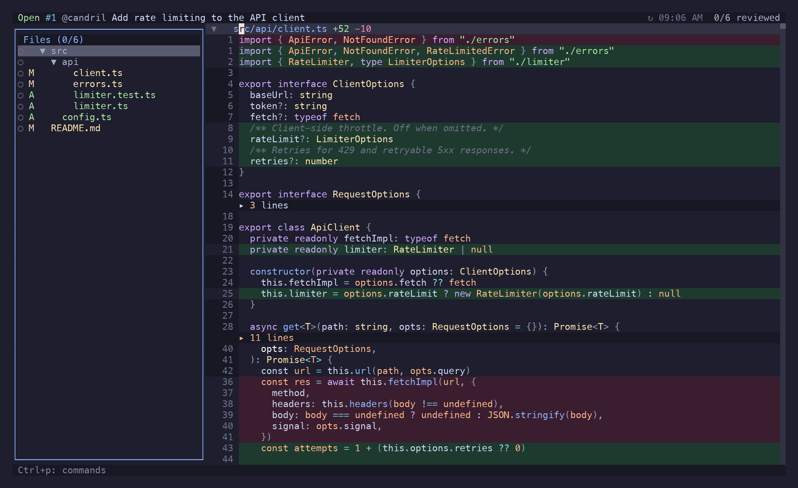
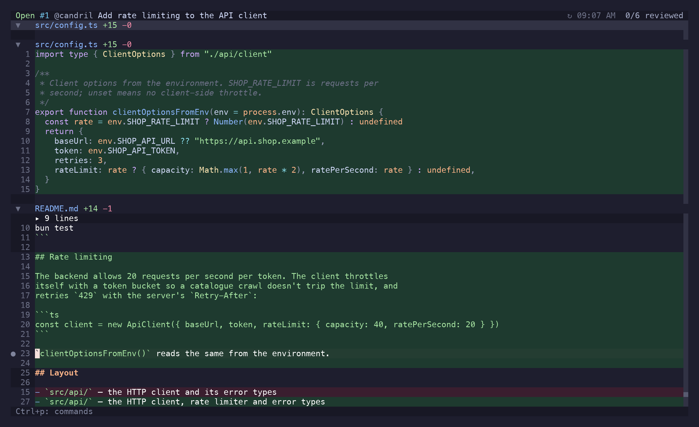
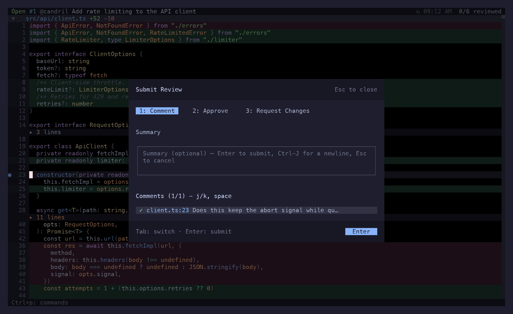
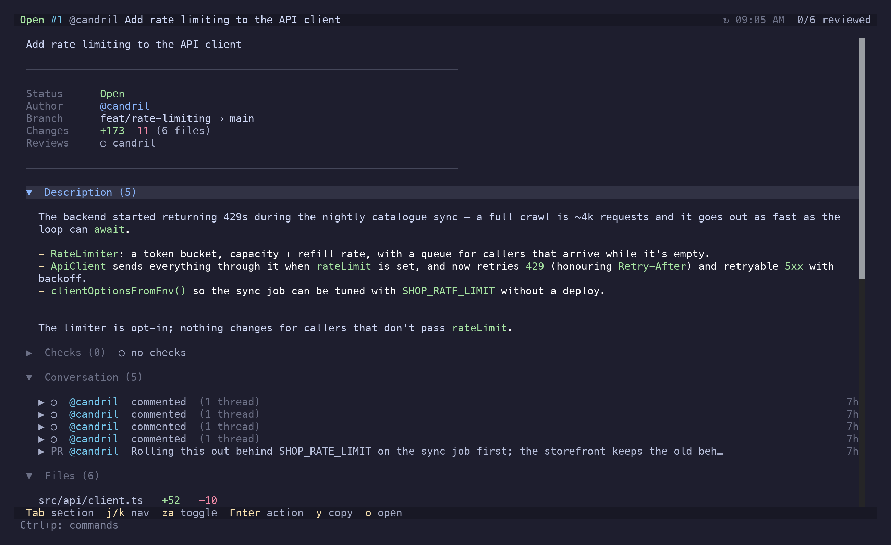
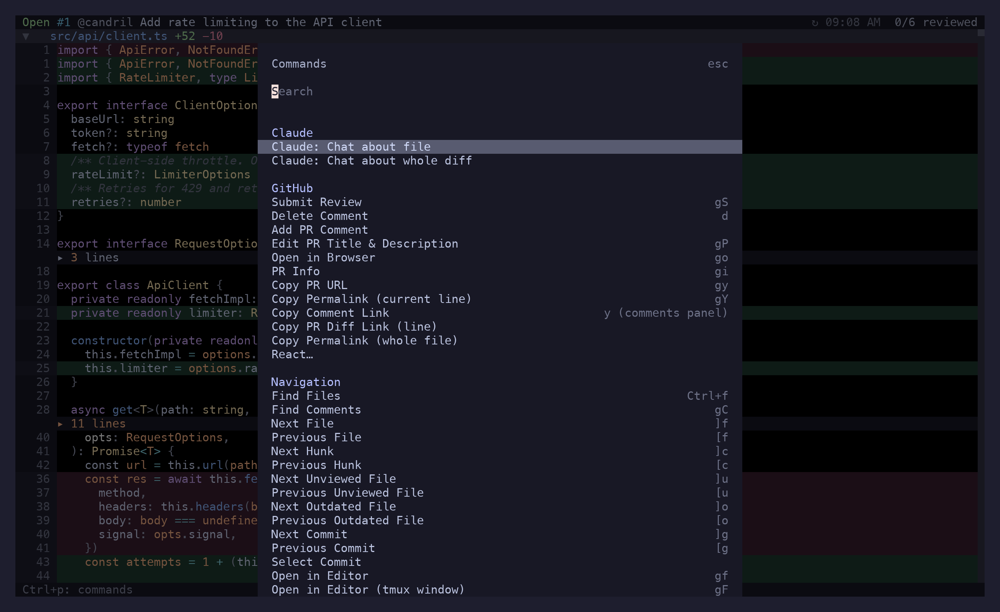

<p align="center">
  
</p>

<h1 align="center">riff</h1>

<p align="center">Review the diff where you wrote it. PRs, branches, working-copy changes — with vim motions, inline comments, and no browser tab.</p>

<p align="center"><a href="https://candril.github.io/riff/"><strong>Documentation</strong></a> · <a href="https://candril.github.io/riff/guide/installation/">Install</a> · <a href="https://candril.github.io/riff/reference/key-bindings/">Key bindings</a> · <a href="https://candril.github.io/riff/reference/comments/">Comments &amp; threads</a></p>

> [!CAUTION]
> **Spec-driven, AI-generated.** Every feature in riff starts as a numbered spec in [`specs/`](specs/), and the code and this documentation were generated from those specs with an AI pair. Use it with care: riff *writes* to GitHub — comments, reviews, thread resolutions, PR titles and bodies. Nothing leaves your machine until you press `gS`, `gs` or `S`, so start on a working copy (`riff` with no argument), then on a PR you don't mind poking at.

```sh
brew install candril/tap/riff           # or: nix run github:candril/riff
riff                                    # review your uncommitted changes
```



---

### One diff, four ways to name it

riff takes a target and works out what you meant — a PR number, a revset, a URL, or nothing at all:

```sh
riff                    # uncommitted changes in the working copy
riff pr                 # the PR for the current branch or bookmark
riff 123                # PR #123 in this repo
riff HEAD~3             # the last three commits
riff main..feature      # a branch comparison
riff @-                 # a jj revset
riff gh:facebook/react#1234
```

Local and PR mode are the same app. Every motion, fold and comment key works in both; PR mode just has GitHub on the other end.

### The diff reads like a buffer

`j k h l`, `w b e`, `f t ; ,`, `0 ^ $`, `gg G`, `Ctrl+d`/`Ctrl+u` — the motions your fingers already know. `]c`/`[c` steps hunks, `]f`/`[f` files, `]u`/`[u` the files you haven't looked at yet. `za` folds a file or a hunk, `zR`/`zM` do the lot. `Ctrl+o`/`Ctrl+i` walk a real jumplist. `s` is a flash jump: type what you can see — a line, or a file's path — and press the label. `/` in the file tree filters it by path.



### Comment on the line, not on a web form

`c` opens the comments panel anchored to the cursor's line; `V` first if it's about a range. `C` hands the draft to `$EDITOR` instead. Comments land in `.riff/` in your repo as Markdown files — yours until you publish, so half a review survives a closed terminal.

`]r`/`[r` walks every thread in the diff, `Enter` opens the one under the cursor. In the panel: `r` replies, `e` edits, `x` resolves, `d` deletes, `y` copies a link.



### Publish deliberately

Nothing reaches GitHub until you say so. `gS` opens the review preview — approve, request changes, or comment, every pending comment batched into one review. `gs` syncs the smaller stuff: edits to comments you already posted, replies, resolutions. `S` posts a single comment when it can't wait.



### The PR, without leaving

`i` toggles between the diff and the PR overview: description, conversation, checks, approvals, commits, files. A failing check expands into its annotations and `Enter` opens the offending line in `$EDITOR`. `]g`/`[g` narrows the diff to one commit at a time.



### A review without GitHub

`riff` on the working copy, comments on the lines, `q`. Then let Claude Code work through them — install riff's plugin once:

```sh
claude plugin marketplace add candril/riff
claude plugin install riff@riff
```

and say *"look at the riff comments"* in any session: it reads them with `riff comments --json`, makes the changes, and retires each with `riff comments resolve <id>`. (`riff comments install-skill` drops the same skill in without a marketplace.) A thread resolved locally is never published; `riff comments clear` — or **Clear Local Comments** — wipes the rest.

### Everything the keyboard can reach

`Ctrl+p` lists every action that applies right now with its shortcut; `g?` draws the keymap. `gf` opens the file at the cursor in `$EDITOR` (`gF` in a new tmux window), `gY` copies a permalink, `gP` creates or edits the PR, `v` marks a file viewed — GitHub's own viewed state, in PR mode. Lock files and generated code stay folded out of the review.



## Install

```sh
brew install candril/tap/riff
```

```sh
nix run github:candril/riff              # try it; `nix profile install github:candril/riff` keeps it
```

```sh
curl -fsSL https://raw.githubusercontent.com/candril/riff/main/scripts/install.sh | bash
```

All three install the same binary — the one attached to the latest
[release](https://github.com/candril/riff/releases), verified against its `SHA256SUMS` — prebuilt
for macOS (Apple Silicon, Intel) and Linux (x64, arm64). The installer puts it in `/usr/local/bin`;
`RIFF_INSTALL_DIR=~/.local/bin` moves it, `RIFF_VERSION=0.1.0` pins it. Needs the [GitHub CLI](https://cli.github.com), logged in, and `git` or [`jj`](https://github.com/jj-vcs/jj).

From source, with [Bun](https://bun.sh): `git clone https://github.com/candril/riff.git && cd riff && bun install && just install-bin`.

## Configuration

`~/.config/riff/config.toml`, everything optional:

```toml
[ignore]
patterns = ["package-lock.json", "*.generated.*"]   # replaces the defaults

[storage]
basePath = "~/code"                                  # find clones by repo name

[storage.repos]
"facebook/react" = "~/code/react"                    # or map them explicitly

[mentions]
extra = ["my-org/backend-team"]                      # teams the @ picker can't discover

[poll]
interval = 300                                       # seconds between comment checks; 0 disables
onFocus = true                                       # only while the terminal has focus
```

The [configuration reference](https://candril.github.io/riff/reference/configuration/) has the rest.

## The other terminal tools

riff is one of five, built the same way and installed the same way (`brew install candril/tap/<tool>`, `nix run github:candril/<tool>`, or the curl installer):

- [**lane**](https://candril.github.io/lane/) — Your Jira board, in the terminal. Read it, move it, and never touch the mouse.
- [**monq**](https://candril.github.io/monq/) — Browse, query, edit. MongoDB without leaving the terminal.
- [**presto**](https://candril.github.io/presto/) — Every open PR across the repos you watch, in one list — and whose move it is.
- [**topiq**](https://candril.github.io/topiq/) — Peek, filter, replay. Kafka without leaving the terminal.

## Development

```sh
just dev        # run from source with hot reload
just test
just typecheck
just build      # standalone binary
just site-dev   # the docs site
just shots      # re-record the docs screenshots (see docs/screenshots.md)
just demo-gif   # re-record the README demo
```

Features are specified before they are built — see [`specs/`](specs/) — and [AGENTS.md](AGENTS.md) describes the codebase.

## License

MIT

---

<p align="center"><sub>One of five terminal tools — one spec-first process, the same three installers:<br><a href="https://candril.github.io/lane/">lane</a> (Jira) · <a href="https://candril.github.io/monq/">monq</a> (MongoDB) · <a href="https://candril.github.io/presto/">presto</a> (pull requests) · <a href="https://candril.github.io/riff/">riff</a> (code review) · <a href="https://candril.github.io/topiq/">topiq</a> (Kafka)</sub></p>
