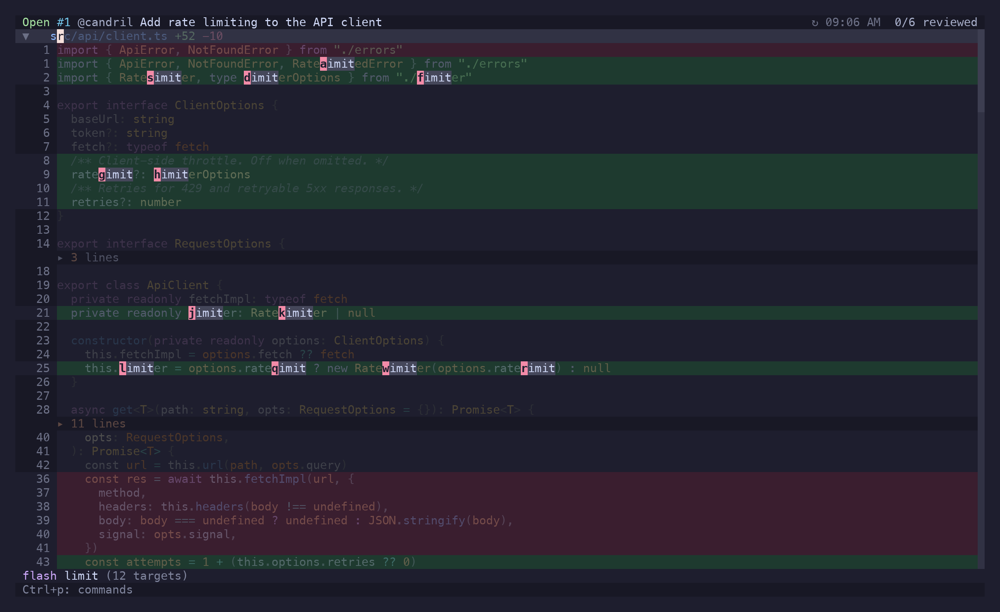
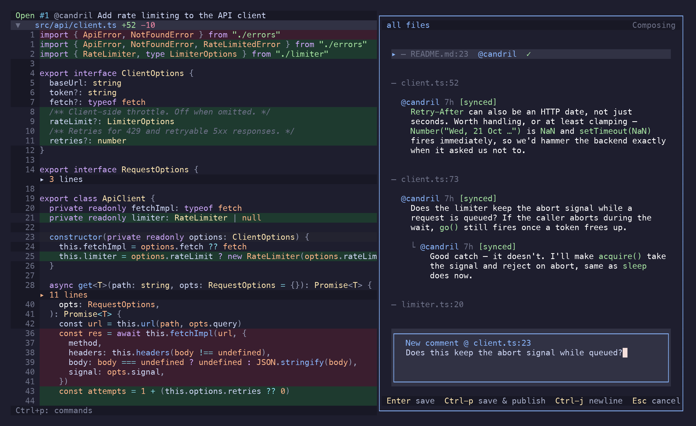

This walks one PR review end to end. Everything here works the same on a local diff — you just
don't have anything to submit at the end.

## Open something

```sh
riff pr        # the PR for the branch or bookmark you're on
```

If riff can't work out which PR that is, give it the number (`riff 123`), the reference
(`riff gh:owner/repo#123`) or the URL. See the [CLI reference](/riff/reference/cli/) for the
full list of targets.

riff fetches the diff, the commits, the review threads and GitHub's viewed state in one round
trip, then drops you on the first file.


## Read the diff

The cursor is a real cursor, on a real line — comments anchor to it, so it moves the way you'd
expect a buffer to move.

| Key | |
| --- | --- |
| `j` `k` `h` `l` | line and column |
| `w` `b` `e` | by word |
| `Ctrl+d` `Ctrl+u` | half a screen |
| `gg` `G` | top, bottom |
| `]c` `[c` | next, previous hunk |
| `]f` `[f` | next, previous file |
| `]u` `[u` | next, previous **unviewed** file |

`Ctrl+b` toggles the file tree on the left; `Ctrl+h` and `Ctrl+l` move focus between the tree,
the diff and the comments panel. `Ctrl+f` is a fuzzy file picker for when the tree is long.

Large files start folded at the hunks you'd expect. `za` toggles the fold under the cursor, `zR`
opens everything, `zM` closes it. When a diff hides unchanged lines behind a divider, `Enter` on
that divider expands them so you can read the surrounding code.

Don't scroll to find something you can already see: `s` starts a
[flash jump](/riff/reference/views/#flash-jump), and `/` is the search you already know.



## Say something

Put the cursor on the line and press `c`. The comments panel opens with a draft anchored there.
For a range, press `V` first and select with `j`/`k` — the comment attaches to the whole span.

Inside the draft:

- `Enter` or `Ctrl+s` saves it **locally**. Nothing is on GitHub yet.
- `Ctrl+p` saves *and* posts it immediately.
- `Ctrl+j` is a newline; `Ctrl+g` hands the draft to `$EDITOR` if it's growing into an essay.
- `@` starts a mention picker over the repo's contributors, plus anything you listed in
  [`mentions.extra`](/riff/reference/configuration/#mentions).
- `Esc` backs out.

Prefer to write in `$EDITOR` from the start? `C` skips the panel.



Saved drafts live in `.riff/` in the repo. Close the terminal, come back tomorrow, and the review
is where you left it. On a local diff they're also a to-do list: `Ctrl+p` → **Claude: Act on
local comments** hands them to Claude Code, and `x` marks a thread done — see
[a review without GitHub](/riff/reference/comments/#a-review-without-github).

## Read what everyone else said

`]r` puts the cursor on the next thread in the diff and `Enter` opens it; `[r` goes back. `]R`/`[R`
do the same but skip resolved threads, which is usually what you want on a PR that has been round the loop a few
times. `gC` opens a fuzzy picker over every comment in the PR when you know roughly what you're
looking for.

With a thread focused in the panel: `r` replies, `e` edits your own comment, `x` toggles resolved,
`d` deletes, `y` copies a link to it, `o` opens the file at that line in `$EDITOR`, and `za`
expands a collapsed or outdated thread to show the original hunk.

## Keep track of what you've read

`v` marks the current file viewed and moves you to the next unviewed one. In PR mode that is
GitHub's own viewed checkbox, so it's the same state the web UI shows and it survives the
session. `]u`/`[u` navigate by it, and the file tree shows it.

## Look at the PR itself

`i` toggles between the diff and the PR overview: description, conversation, review threads,
checks, approvals, commits and files. `l`/`h` expand and collapse, `za` folds a section, `c`
writes a conversation comment (the kind not attached to code), `x` resolves the focused thread.

A failing check expands into its annotations, and `Enter` on one opens that file at that line in
`$EDITOR` — including files this PR never touched.

`]g`/`[g` narrows the diff to one commit at a time, wrapping back round to the whole thing. On a
PR that was written commit by commit, that's the order it reads best in.

## Submit

Two different actions, deliberately:

- **`gS` — submit review.** Opens a preview of every pending comment, then asks for the verdict:
  approve, request changes, or comment. All of it goes up as one review.
- **`gs` — sync changes.** Pushes the smaller edits: changes to comments you already posted,
  replies to other people's threads, resolutions. No review event, no notification storm.

`S` on a single draft posts just that one, immediately.

Both open a preview first. Nothing is sent until you confirm in it.


## Everything else

`Ctrl+p` is the answer to "can riff do X". It lists every action that applies to the state you're
in right now, with its shortcut — creating a PR from local changes (`gP`), copying a permalink
(`gY`), opening the file in your editor (`gf`), viewing the file through `difftastic` or `delta`,
handing the selection to Claude Code, and the rest.

`g?` draws the keymap over the diff when you'd rather see the shape of it than search. `q`
quits — your drafts are already on disk.
