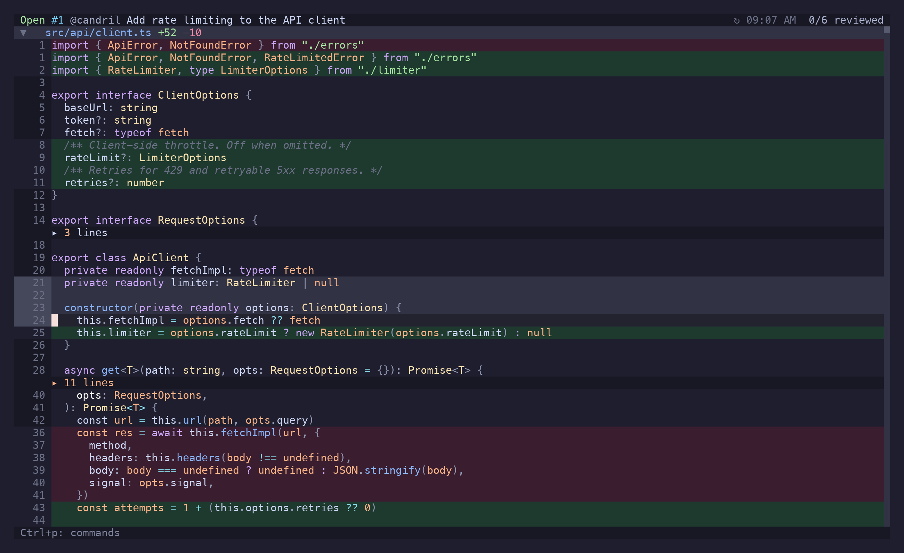
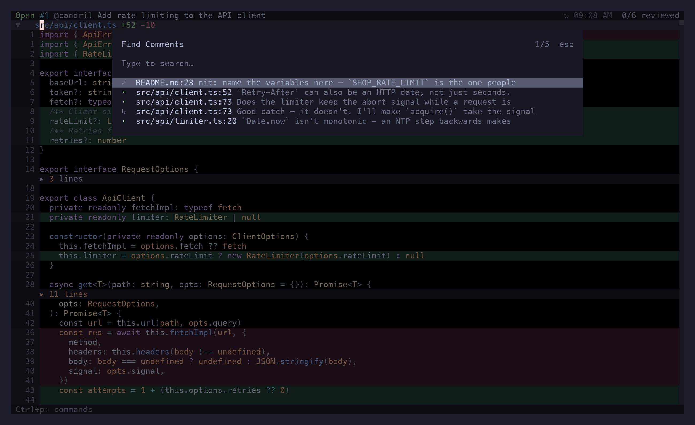

A comment in riff is a file on your disk until you decide otherwise. That's the whole design: an
interrupted review is a directory of Markdown files, not a lost tab.

## Writing one

| From | Key |
| --- | --- |
| The diff, on the cursor's line | `c` |
| The diff, on a range | `V` to select, then `c` |
| The diff, in `$EDITOR` | `C` |
| The comments panel | `n` |
| A reply to the focused thread | `r`, or `R` for `$EDITOR` |
| A PR-level comment, not on any code | **Add PR Comment** in `Ctrl+p` |

The draft opens in the comments panel with the anchor shown above it. `Enter` or `Ctrl+s` saves
it locally, `Ctrl+p` saves and posts it in one go, `Ctrl+j` is a newline, and `Ctrl+g` moves the
half-written draft into `$EDITOR` and brings the result back.



### Suggestions

`Ctrl+y` in a draft writes a ```` ```suggestion ```` block prefilled with the lines the comment
is anchored to, as they read now. Edit them in place; GitHub shows the result as a change the
author can apply with one click. A comment written on a range covers the whole block, so the
suggestion replaces exactly the lines that were selected.

### Mentions

`@` in a draft opens a picker over the repo's contributors, fetched once and cached for a day.
Teams and bots can't be discovered through the API riff queries, so list the ones you use in
[`mentions.extra`](/riff/reference/configuration/#mentions) and they'll show up alongside.

## Where a comment can go

GitHub decides this, and it's narrower than the web UI suggests:

| Line | Commentable |
| --- | --- |
| Added or deleted | yes |
| Unchanged, but inside a hunk the diff shows | yes |
| Unchanged, only visible because you expanded a divider | **no** |
| The file as a whole | yes |

The last row of that table is why riff refuses an expanded line up front instead of letting you
write a paragraph and then showing you a 422. No public API can anchor a review comment outside
every hunk — the web UI manages it by re-resolving positions server-side, and that path isn't
exposed. Expanding context is for reading.

When GitHub does reject something, riff shows GitHub's own message rather than `gh`'s generic
"Validation Failed", with a hint for the three failures that actually happen: an unresolvable
line, a pending review already open on the PR, and a stale head commit.

## Local, pending, synced

Every comment carries a status:

- **local** — written by you, on disk, invisible to everyone else.
- **pending** — submitted as part of a review that GitHub hasn't published yet.
- **synced** — live on GitHub.

Editing a synced comment doesn't overwrite it; the edit is kept alongside the original until you
`gs`, so the panel can show you the two and a failed sync can't lose your text.

A local thread you resolve with `x` is **done, not pending**: it is never published — not by
`gS`, not by `gs`, not by `S`. That's how a local review says "handled", and why resolving is
safe to do before anything has left the machine.

Publishing is always explicit:

| Key | What goes up |
| --- | --- |
| `gS` | Every local comment, batched into one review, with a verdict |
| `gs` | Edits to synced comments, replies, resolutions |
| `Ctrl+p` in a draft | That one comment, immediately |
| `S` on a comment | The same, from the panel |

See [GitHub Workflow](/riff/reference/github/) for what each of those actually sends.

## Threads

Replies group into threads under their root comment. `]r`/`[r` walks the cursor from thread to
thread across the whole diff, `Enter` opens the one you're on, and once the panel is open `J`/`K`
move it along; `]R`/`[R` skip resolved ones. `gC` is a fuzzy search over every comment in the
PR — author, body, file — for when you remember the sentence but not the file.



In the panel, with a thread focused:

- `x` toggles resolved. Resolved threads collapse to their root so they stop taking up the
  screen; `za` opens one back up.
- `r` replies, re-anchoring to that thread's file and line first — so replying after you've
  navigated elsewhere still lands in the right place.
- `e` edits your own comment, `d` deletes it (with a confirmation).
- `y` copies a GitHub link to the comment.
- `o` opens its file at its line in `$EDITOR`.
- `O` opens the images the comment carries in your browser.

### Images

riff can't draw a screenshot in the terminal, and GitHub serves attachments to a browser session,
so on a private repo it can't even fetch them. A comment's images show up as `▣` rows naming each
one — alt text, or the file name — and `O` hands them to your browser, which is signed in.

### HTML in comments

Comment bodies render as markdown. Tables are drawn with wrapping cells — a row grows to its
tallest cell rather than losing everything past the first line, which is what the underlying
renderer does on its own. The HTML people write in GitHub comments is
translated first, since the markdown renderer would otherwise print the tags: `<br>` becomes a
line break (a middle dot inside a table cell, where a newline would end the row), `<b>`/`<i>`/
`<code>` become their markdown equivalents, an `<a href>` becomes a link, and a `<details>` block
is shown open with its summary as a heading — there is nothing to click in a terminal.

Tags with no obvious meaning are left as they are rather than guessed at, and anything inside a
code span or fence is untouched: there, the tag is the text the author meant to write.

### Outdated threads

A thread whose anchor no longer matches the PR head is marked outdated. It keeps the diff hunk it
was written against, and `za` shows you that hunk — usually the only way left to work out what
the comment meant. `]o`/`[o` navigates files in the same situation: ones you marked viewed that
have changed since.

### Links in a comment

`gx` lists the links in every comment the panel is showing — the highlighted one first, each row
saying who wrote it — and opens the one you pick; `Ctrl+y` copies it instead. A `#1213` is listed
as the pull request it points at, title and state included, which is the part a terminal's own
click-the-URL cannot do for you.

### Reactions

`React…` in the action menu adds or removes a reaction on whatever comment is focused — in the
panel, the picker, or the PR overview. Reactions come down with the PR and update optimistically.

## On disk

Comments are Markdown files with YAML frontmatter, under `.riff/` in the repo:

```text
.riff/
├── comments/
│   └── gh-owner-repo-123/
│       ├── <uuid>.md
│       └── <uuid>.md
├── gh-owner-repo-123/
│   └── viewed.json
├── mentionable-users.json
└── session.json
```

One file per comment:

````markdown
---
id: 6f1c…
filename: src/api/client.ts
line: 19
side: RIGHT
createdAt: 2026-03-04T10:12:00.000Z
status: local
commit: 3b1f2ad
---

does this keep the abort signal?

<!-- context -->
```diff
@@ -18,7 +18,9 @@
-  const res = await fetch(url)
+  const res = await limiter.run(() => fetch(url))
```
````

Which means a draft is greppable, diffable, and editable in your editor if you'd rather. Deleting
the directory throws away unpublished work and nothing else.

Where `.riff/` ends up for a PR from a repo you're not sitting in is the
[storage](/riff/reference/configuration/#storage) config's job.

## A review without GitHub

`riff` on the working copy, `c` on the lines, `q` — the comments are in `.riff/comments/local/`
and nothing else happens. Three ways to take it from there:

**Act on them with Claude.** Install riff's plugin once —

```sh
claude plugin marketplace add candril/riff
claude plugin install riff@riff
```

— or, without a marketplace, drop the skill straight in:

```sh
riff comments install-skill            # this repo
riff comments install-skill --global   # ~/.claude, every repo
```

Either way, in any Claude Code session in the repo: *"look at the riff comments"*. It reads them with
`riff comments --json` (anchor, body, the diff hunk they were written against), makes the
changes, and retires each one as it goes:

```sh
riff comments resolve 29a00758       # done — the thread will never be published
riff comments remove 29a00758        # or delete it outright
```

riff doesn't launch Claude and doesn't hand anything over; the skill and the CLI are the whole
integration. Come back to riff and the resolved ones are folded, the removed ones gone: with
[`poll.onFocus`](/riff/reference/configuration/#poll) on, a local session re-reads the diff and
`.riff/` when the terminal regains focus, and `gr` does it on demand.

**Clear them.** `Ctrl+p` → **Clear Local Comments** deletes every local comment for the review
after a confirmation; `riff comments clear` does it from the shell. Synced comments are never
touched.

**Or just leave them.** Opening the PR later neither imports nor removes them — a PR review
keeps its own set under `.riff/comments/gh-owner-repo-123/`.

## Claude-drafted comments

riff never posts on Claude's behalf. When a Claude Code session drafts an inline comment, riff
raises a notification; **Claude: Copy drafted comment** in the action menu puts it on your clipboard and
clears it, **Claude: Dismiss drafted comment** throws it away. What you do with the text after that is a
normal comment, written by you.

The Claude actions in `Ctrl+p` go the other way — they hand a scope (the selection, the file, the
folder, a multi-select, or the whole diff) to a Claude Code session to talk about.
