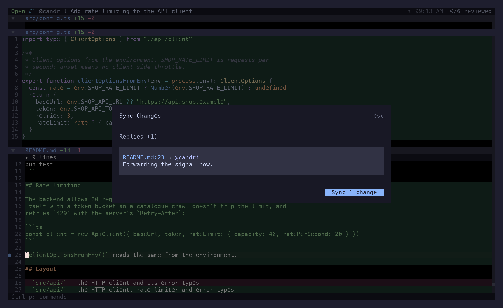

riff has no GitHub credentials of its own. Every call shells out to the [`gh` CLI](https://cli.github.com/),
so it acts as whatever account `gh auth status` reports and inherits that token's scopes. If `gh`
can do it in your terminal, riff can; if it can't, riff can't either.

## Opening a PR

```sh
riff pr                 # the PR for the current branch or bookmark
riff 123                # by number, in this repo
riff gh:owner/repo#123  # from anywhere
riff https://github.com/owner/repo/pull/123
```

Startup is one GraphQL query: PR metadata, review threads, comments, commits, checks and viewed
statuses in a single round trip, plus a REST call for the diff. On a cold start you wait once,
not six times.

Before fetching, riff settles where comments will be stored — see
[storage](/riff/reference/configuration/#storage) — and asks for confirmation if it had to guess
a local clone. The prompt comes before the fetch so you're not answering it after a wait.

## Publishing

Three separate gestures, because they mean three different things to the people watching the PR.

### `gS` — submit a review

Opens the review preview: your pending comments on one side, a summary box on the other.

| Key | |
| --- | --- |
| `1` `2` `3` | Comment, approve, request changes |
| `Tab` | Move between the summary and the comment list |
| `j` `k` | Walk the comments |
| `space` | Exclude the highlighted comment from this review |
| `Enter` / `Ctrl+s` | Submit |
| `Esc` | Back out |

Everything included goes up as **one review** — one notification, one entry in the conversation.
On your own PR, approve and request-changes are unavailable, because GitHub doesn't allow them.

If GitHub already holds a pending review of yours (started in the web UI, or by a previous
partial submit), riff submits that one with your chosen verdict first, then posts the new
comments as a follow-up review. A stranded pending review is also the reason single-comment
posting sometimes fails with `user_id can only have one pending review per pull request` —
submitting or discarding it clears the jam.


### `gs` — sync changes

The maintenance pass, with no review event attached:

- edits to comments you'd already posted,
- replies to existing threads,
- thread resolutions.

`gs` opens a preview of exactly what will be sent; `Enter` confirms, `Esc` cancels.



### Post one comment now

`Ctrl+p` while writing, or `S` on a comment in the panel. Posts that single comment straight away.
Useful for a question you want answered before you've finished reading; not the way to deliver a
review.

## Other PR actions

| Key | Action |
| --- | --- |
| `gr` | Refresh — diff, commits, comments, checks |
| `gi` / `i` | PR overview |
| `go` | Open the PR in a browser |
| `gy` | Copy the PR URL |
| `gY` | Copy a permalink to the selection, the line, or the file |
| `gP` | Edit the PR title and body in `$EDITOR` |
| `gc` | Check out the PR branch, then open the current file in `$EDITOR` |

**Copy PR Diff Link** in the action menu is the other kind of link: it points at the change in
the PR's Files-changed tab rather than at the blob. Permalinks pin to the branch, so they survive
a force-push differently than a line link does — pick the one whose failure mode you want.

## Creating a PR

In local mode, `gP` creates one. riff opens `$EDITOR` on a git-commit-verbose-style template:
title on the first line, body under it, a `# Draft: no` toggle, then a scissors line with the
branch, the file summary and the whole diff below it as context you can read while you write.
Everything under the scissors is dropped, the rest goes to `gh pr create`, and the session
switches itself over to reviewing the PR it just made.

`gP` in PR mode edits the existing title and body through the same template.

## Viewed status

`v` writes GitHub's own viewed checkbox, and riff reads it at startup. Marking a file viewed in
riff shows up in the web UI, and the other way round after a `gr`. riff additionally records the
commit you viewed it at, which GitHub does not, so it can tell you a file changed after you
signed it off — `]o`/`[o` walks those.

## Background polling

New replies land without you asking. The poll costs one GraphQL point per tick, defaults to five
minutes, skips ticks while the terminal is unfocused and refreshes when focus comes back:

```toml
[poll]
interval = 300   # seconds; 0 disables it
onFocus = true
```

`gr` refreshes on demand regardless. In local mode there is nothing to poll, but `onFocus` still
re-reads the diff and `.riff/` when the terminal regains focus — which is what makes a Claude
session retiring comments through `riff comments` show up without a keypress.

## API budget

Worth knowing if you keep several riff panes open: GitHub meters GraphQL in **points**, not
requests — 5000 an hour, on a quota separate from REST's 5000 — and it prices a query by its
nested node count. riff's measured costs are 51 points for a full thread fetch, 2 for a
probe-depth one, 1 for the poll's thread-state check, 2 for metadata reactions, 1 for viewed
statuses. Note that `gh pr view --json …` is GraphQL too, not REST.

## Repositories you're not standing in

`riff gh:owner/repo#123` works from anywhere. riff resolves a local clone for comment storage in
this order: an explicit [`storage.repos`](/riff/reference/configuration/#storage) mapping, the
current directory if it happens to be that repo, then a search under `storage.basePath` — which
it confirms with you before using. Failing all that, comments go to `~/.riff/`.

Only comment storage needs the clone. The diff itself comes from GitHub.
