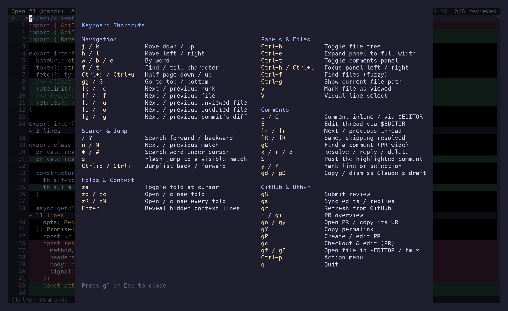

Keys are contextual: the same letter means different things in the diff, in the comments panel
and in the PR overview. Each table below is one surface.

`g?` opens the keymap overlay — this page, condensed, without leaving the app. `Ctrl+p` opens the
action menu, which is the authoritative list: it shows only what applies to the state you're in,
with the shortcut next to it. Bindings are not configurable yet.

## Motions

In the diff. These follow vim, including the ones you only notice when they're missing.

| Key | Action |
| --- | --- |
| `j` `k` | Down, up (arrow keys too) |
| `h` `l` | Left, right |
| `w` `e` `b` | Word forward, end of word, word back |
| `0` `^` `$` | Line start, first non-blank, line end |
| `f{char}` `t{char}` | Find character forward, till character |
| `;` `,` | Repeat that find, forward and back |
| `Ctrl+d` `Ctrl+u` | Half page down, up |
| `gg` `G` | Top, bottom of the diff |
| `V` | Visual line mode — select a range for a comment or a yank |
| `Esc` | Leave visual mode, or clear search highlights |

## Jumping

| Key | Action |
| --- | --- |
| `]c` `[c` | Next, previous hunk |
| `]f` `[f` | Next, previous file |
| `]u` `[u` | Next, previous unviewed file |
| `]o` `[o` | Next, previous outdated file — viewed, but changed since |
| `]r` `[r` | Next, previous comment thread |
| `]R` `[R` | Same, skipping resolved threads |
| `]g` `[g` | Next, previous commit's diff; wraps back to the full diff |
| `s` | Flash jump — search what's on screen, press a label to land (file headers included) |
| `Ctrl+o` `Ctrl+i` | Jumplist back, forward (`Tab` is forward too) |

Every one of these records a jumplist entry, so `Ctrl+o` undoes it.

## Search

| Key | Action |
| --- | --- |
| `/` `?` | Search forward, backward |
| `n` `N` | Next, previous match |
| `*` `#` | Search the word under the cursor, forward and backward |
| `Esc` | Clear the highlights |

## Folds

| Key | Action |
| --- | --- |
| `za` | Toggle the fold at the cursor — file header or hunk |
| `zo` `zc` | Open, close it |
| `zR` `zr` | Open every fold |
| `zM` `zm` | Close every fold |
| `Enter` | On a context divider: reveal the hidden unchanged lines |

Expanded context lines are for reading only — GitHub can't anchor a comment outside a hunk.

## Files and panels

| Key | Action |
| --- | --- |
| `Ctrl+b` | Toggle the file tree |
| `Ctrl+e` | Toggle the file tree — or the comments panel, when it has focus — to full width |
| `Ctrl+h` | Move focus left: comments → diff → tree |
| `Ctrl+l` | Move focus right: tree → diff → comments |
| `Ctrl+t` | Toggle the comments panel |
| `Ctrl+f` | Fuzzy file picker |
| `Ctrl+g` | Show the current file's path |
| `v` | Mark the file viewed and advance to the next unviewed |
| `Esc` | Leave single-file view — after clearing a selection or search highlights |

In the **file tree**: `j`/`k` moves, `l`/`Enter` opens a file or expands a folder, `h` collapses,
`v` toggles viewed, `/` filters by path, `Esc` hands focus back to the diff.

Filtering: `/` opens an input in the panel header, typing narrows the tree live (loosely, against
the whole path — `apicl` finds `src/api/client.ts`), `Enter` keeps the filter and returns to
navigating it, `Esc` drops it. It's a real text field, so `Ctrl+w`, word jumps, paste and undo all
work.

`Backspace` clears an applied filter from anywhere — the tree or the diff — before it does
anything else. `Esc` in the tree clears it too, after any multi-select and before leaving the
panel.

## Comments

From the diff:

| Key | Action |
| --- | --- |
| `c` | Comment on the cursor's line, or on the visual-line selection |
| `C` | The same, drafted in `$EDITOR` |
| `E` | Edit the thread on this line in `$EDITOR` |
| `Enter` | Open the thread on this line in the comments panel |
| `gC` | Fuzzy picker over every comment in the PR |

In the **comments panel** (focused — `Ctrl+t`, or `Enter` on a thread):

| Key | Action |
| --- | --- |
| `j` `k` | Move between comments |
| `J` `K` | Jump to the next, previous thread |
| `Ctrl+d` `Ctrl+u` | Half a screen of comments |
| `za` / `Enter` | Expand or collapse the highlighted thread |
| `n` | New comment at the diff cursor's line |
| `r` `R` | Reply inline, reply in `$EDITOR` |
| `e` `E` | Edit inline, edit in `$EDITOR` |
| `d` | Delete the highlighted comment |
| `x` | Toggle the thread resolved |
| `S` | Post this one comment now |
| `y` | Copy a link to it |
| `o` | Open its file at its line in `$EDITOR` |
| `q` `Esc` `Ctrl+h` | Close the panel, or hand focus back |

While **writing** a comment:

| Key | Action |
| --- | --- |
| `Enter` / `Ctrl+s` | Save locally |
| `Ctrl+p` | Save and post it to GitHub now |
| `Ctrl+j` | Newline |
| `Ctrl+g` | Continue in `$EDITOR` |
| `@` | Mention picker — `↑`/`↓` or `Ctrl+p`/`Ctrl+n`, `Tab`/`Enter` accepts |
| `Esc` | Cancel |

`Ctrl+Enter` also posts, in the terminals that can send it. `Ctrl+p` is the one that works
everywhere, tmux included. In local mode both just save — there's nothing to post to.

## GitHub

| Key | Action |
| --- | --- |
| `gS` | Submit review — opens the preview |
| `gs` | Sync edits, replies and resolutions |
| `gr` | Refresh diff, commits and comments |
| `gi` | PR overview panel |
| `i` | Toggle diff ↔ PR overview |
| `go` | Open the PR in a browser |
| `gy` | Copy the PR URL |
| `gY` | Copy a permalink to the selection, line, or file |
| `gP` | Edit the PR title and body — or create a PR, in local mode |
| `gc` | Check out the PR branch and open the file in `$EDITOR` |

In the **review preview** (`gS`): `1` `2` `3` pick comment / approve / request changes, `Tab`
switches between the summary box and the comment list, `j`/`k` walks it, `space` excludes a
comment from this review, `Enter` or `Ctrl+s` submits, `Esc` backs out. The **sync preview**
(`gs`) is simpler: `Enter` confirms, `Esc` cancels.

## PR overview

`i` or `gi` gets you here. Sections are description, conversation, checks, approvals, commits and
files.

| Key | Action |
| --- | --- |
| `j` `k` | Move |
| `l` `h` | Expand, collapse the selected item |
| `za` | Fold the section, thread, or check under the cursor |
| `zr` `zR` / `zm` `zM` | Expand, collapse one section or all of them |
| `c` | Write a conversation comment |
| `x` | Toggle the focused review thread resolved |
| `Enter` | Context-dependent: open a check's annotation in `$EDITOR`, expand a failing check, or open the item in a browser |
| `y` | Copy a link to the focused item |
| `gg` | Top |
| `gr` `go` `gy` | Refresh, open in browser, copy PR URL — as everywhere |
| `q` `Esc` `Tab` `i` | Back to the diff |

## Editor and clipboard

| Key | Action |
| --- | --- |
| `gf` | Open the current file in `$EDITOR` at the cursor's line |
| `gF` | The same, in a new tmux window, with riff still running |
| `y` | Yank the line or selection, without the `+`/`-` gutter |
| `Y` | Yank it with the gutter intact |
| `gd` `gD` | Copy, dismiss a comment Claude drafted |

## Pickers and menus

Every fuzzy picker — files (`Ctrl+f`), comments (`gC`), commits, the action menu (`Ctrl+p`) —
takes the same keys: type to filter, `↑`/`↓` or `Ctrl+p`/`Ctrl+n` to move, `Enter` to choose,
`Esc` to cancel.

## Global

| Key | Action |
| --- | --- |
| `Ctrl+p` | Action menu |
| `g?` | Keymap overlay (`Esc` or `q` closes) |
| `Ctrl+o` | Jump back |
| `q` | Quit |
| `y` / `n` | Answer a confirmation dialog |

Chords (`g`, `z`, `]`, `[`) time out after half a second, so a `g` you didn't mean to press
costs nothing.
