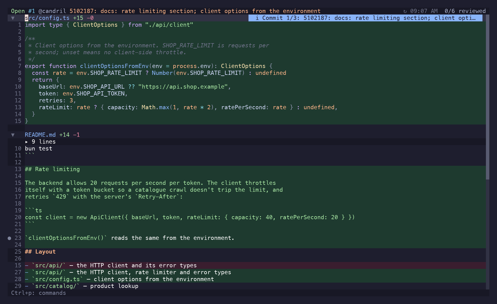

riff is one screen with panels that come and go. The diff is always the middle; the file tree
docks left, the comments panel right, and the PR overview replaces the diff entirely.

<div class="tui-sketch">

```text
 riff · #412 Add rate limiting                        3 files · 2 threads   ← header
┌──────────────────┬──────────────────────────────┬────────────────────────┐
│  file tree       │  diff                        │  comments              │
│  Ctrl+b          │                              │  Ctrl+t                │
└──────────────────┴──────────────────────────────┴────────────────────────┘
 ]c hunk  ]f file  v viewed  c comment  Ctrl+p actions                      ← status bar
```

</div>

`Ctrl+h` and `Ctrl+l` move focus across that row. `Ctrl+e` blows the focused side panel up to
full width when a path is too long or a thread too deep to read in a column.


## The diff

Syntax-highlighted through Tree-sitter, with a cursor that sits on an actual line — which is what
makes `c` able to anchor a comment, and `y` able to yank without the `+`/`-` gutter.

Two shapes:

- **All files**, one after another, with foldable file headers. This is the default, and picking a
  file in the tree or the picker scrolls to it here rather than leaving it.
- **Single file**, for reviewing one file with nothing else on screen. **Open File Alone** in the
  action menu narrows to the file at the cursor; `Esc` goes back.

Threads that exist on a line show as a marker in the gutter and a preview under it, so you can
read a conversation without opening anything. `Enter` opens the thread properly.

Unchanged lines that the diff elided sit behind a divider. `Enter` on the divider expands them,
for reading. They are not commentable: GitHub cannot anchor a review comment to a line outside
every hunk, so riff [refuses up front](/riff/reference/comments/#where-a-comment-can-go) rather
than after you've written it.

### Long lines

The diff does not wrap by default: a wrapped line takes several rows, and one row per line is the
shape you scan a diff for. Long lines scroll sideways instead, and the cursor drags the view with
it — `$`, `w` or a search match past the right edge brings its column into view, with a few
columns of lookahead, the way `sidescrolloff` does in vim.

`zl` and `zh` scroll one column, `zL` and `zH` half a screen, and `zs`/`ze` put the cursor's
column against the left or right edge. The line numbers and comment markers stay pinned at the
left while you scroll; only the code moves.

While the cursor sits on a line wider than the window, the status bar reads `col 84/312` — where
you are, and how much line is left.

A line that continues past the right edge ends in a dim `›`, and one with content scrolled off to
the left gets a `‹` in the gutter's padding — so a truncated line never reads as a line that
simply ends there.

`zw` soft-wraps the whole diff instead, if you would rather pay that cost than scroll. Wrapping
breaks on words, and a row a line continues onto is marked `↳` in the gutter, so a wrapped line
never reads as a new one. Everything
else keeps working, the cursor and comment anchors included. Set `wrap = true` under `[diff]` in
the config file to start that way.

When a line is long enough that scrolling through it is more work than reading it is worth, `gl`
shows the whole thing wrapped in an overlay, still syntax-highlighted — the alignment the diff has
to keep doesn't matter there. `Esc` closes it. For the truly pathological ones, `gf` opens the file in `$EDITOR`, and
generated files belong in [ignore patterns](/riff/reference/configuration/#ignore) rather than in
a review.

There is no horizontal scrollbar. One long line anywhere makes the content wider than the
viewport, and the bar would then sit across the bottom of the diff for the rest of the review.

### Folds

`za` toggles what's under the cursor: a file header folds the whole file away, a hunk header
folds the hunk. `zR` and `zM` do the whole diff at once. Marking a file viewed folds it, so the
diff shortens as you work through it.

### Flash jump

`s` dims the diff and starts a literal, case-insensitive search over what is currently on screen.
Every match gets a single home-row label drawn on the cell the cursor would land on; press it and
you're there. `Backspace` un-types, `Esc` or `Enter` leaves without moving.

In the all-files view the file headers are targets too, and a header's text is its full path — so
`s` then part of a path jumps to that file, without a second key to remember.

It's the fast path when the target is already visible — you type the characters and the label in
one motion instead of `/pattern<CR>nnn`. For anything off screen, use `/`.


### Search

`/` and `?` search the rendered diff in either direction, `n`/`N` repeat, `*`/`#` take the word
under the cursor. Matches stay highlighted until `Esc`.

## File tree

`Ctrl+b`. Directories collapse, and each file carries its status: added, modified, deleted,
viewed, has comments, ignored. `v` marks viewed from here too, and `Ctrl+e` expands the tree to
full width when the paths are long.

Files matched by your [ignore patterns](/riff/reference/configuration/#ignore) are hidden — lock
files, generated code, snapshots. **Toggle Hidden Files** in the action menu brings them back
when you actually do need to look at the lockfile.

`/` with the tree focused filters it by path: the header turns into a text field, the tree narrows
as you type (loosely, against the whole path), `Enter` keeps the filter, `Esc` drops it, and
`Backspace` in the tree clears it. Editing keys behave as they do in any input
(`Ctrl+w` deletes a word). Matching directories come back expanded, so nothing hides in a fold,
and your own expansion state returns with the filter cleared.

The all-files diff narrows with the tree — while a filter is on it lists exactly the files the
sidebar does, so `/` is how you read a subset of a large PR end to end.

`Enter` on a file scrolls the diff to it and leaves the rest of the diff in place: picking a file
is navigation, not a decision to review it alone.

`Ctrl+f` is the fuzzy picker over the same list — the filter when you want the tree to stay, the
picker when you just want the file.

### Viewed state

`v` marks the file viewed, collapses it, and moves you to the next unviewed one; `]u`/`[u`
navigate by it directly. riff records the commit you viewed it at, so a file that changes after
you signed it off shows as **outdated** — `]o`/`[o` walks exactly those. In PR mode this is
GitHub's own viewed checkbox, read at startup and written back, so it agrees with the web UI.

## Comments panel

`Ctrl+t`, `Enter` on a line that has a thread, or `c` to write one. It shows the threads for the
current file — or the one you opened — as a conversation:
author, age, resolution state, replies, reactions.

Threads collapse to their root comment when resolved, and `za` opens them back up. An **outdated**
thread — one anchored to a line the branch has since moved past — expands to show the hunk it was
originally written against, so the comment still makes sense.

Composing happens in the same panel: `n` for a new comment, `r` to reply, `e` to edit. `Ctrl+g`
escalates a draft to `$EDITOR` mid-sentence and drops the result back in. In a local review the
footer stops offering to publish — `Ctrl+p` there just saves.


## PR overview

`i` toggles it, `gi` goes straight there. It replaces the diff with the PR itself:

- **Description** — the body, rendered.
- **Conversation** — PR comments and review threads, expandable with `l`, resolvable with `x`,
  and `c` writes a new one.
- **Checks** — status per check. A failing one expands into its annotations, and `Enter` on an
  annotation opens that file at that line in `$EDITOR`. Annotations often point at files the PR
  never touched, which is why they open in the editor rather than in the diff.
- **Approvals** — who reviewed and what they said.
- **Commits** — the ones the PR carries.
- **Files** — the changed list, with viewed state.

Sections fold with `za`, `zm`/`zr`, `zM`/`zR`. Reactions can be added to whatever is focused via
the action menu.


## Commit filtering

`]g` narrows the diff to the first commit, `]g` again to the second, and past the last one it
wraps back to the whole diff; `[g` goes the other way. The action menu has **Select Commit** for
picking one out of a fuzzy list instead.

Useful on a PR whose commits are actually a sequence of arguments rather than a pile of
autosaves.



## Action menu

`Ctrl+p`. Type to filter, `Enter` to run. It only lists what applies right now: no
**Submit Review** on a local diff, no **Open in Editor (tmux window)** outside tmux, no
**Copy drafted comment** without a draft. It also carries the actions that have no key of their
own — creating a PR comment, viewing the file through `difftastic`, `delta` or `nvim` diff mode,
toggling hidden files, reactions, and the Claude Code handoffs.


## Keymap overlay

`g?` draws the cheat sheet over whatever you were looking at — motions, jumps, folds, panels,
comments, GitHub — and `g?`, `Esc` or `q` puts it away. It's the short version; the action menu
is the exhaustive one.


## Toasts and dialogs

Transient messages — the copied path, the sync result, a failed API call — appear as a toast at
the bottom and clear with `Esc`. Destructive things ask first: `y` confirms, `n` or `Esc`
cancels.
