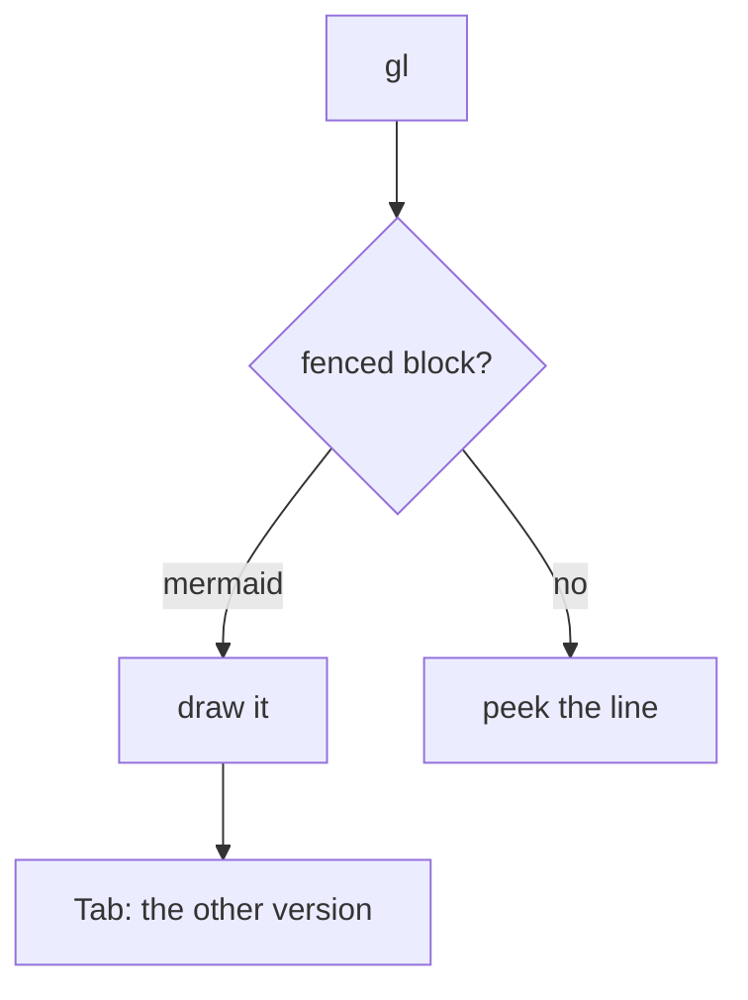

# Mermaid Diagrams

**Status**: Done

## Description

A changed mermaid block in a diff is a picture nobody can see. `gl` on one
draws it: flowcharts and sequence diagrams in box-drawing characters, on the
version the change arrives at, with `Tab` to look at the one it replaces.

## Out of Scope

- Rendering a real image. GitHub renders mermaid client-side, so its API hands
  back the source and not a picture — verified against `POST /markdown`, which
  returns `<pre lang="mermaid">`. Drawing an image in the terminal needs a
  graphics protocol opentui has no renderable for, and riff repaints the frame
  every render, so anything drawn underneath is lost.
- Shelling out to `mmdc`, `graph-easy` or `mermaid.ink`. The first two are
  dependencies riff would have to ask for; the third posts a private repo's
  diagrams to a public server.
- `classDiagram`, `stateDiagram`, `erDiagram`, `gantt`, `pie`, `journey`,
  `gitGraph`. They are named and the source is shown instead.
- Subgraph boxes. The nodes inside are drawn, the grouping is not, and the
  peek says so.
- Scrolling a diagram too big for the window. It is cut, and the peek says
  that too.

## Capabilities

### P1 - Flowcharts

- `graph` and `flowchart`, in `TD`/`TB`, `LR`, `BT` and `RL`.
- Node shapes: `[rect]`, `(round)`, `([stadium])`, `((circle))` and
  `{decision}`, which is drawn with its corners leaning in.
- Edge styles — `-->`, `---`, `-.->`, `==>` — and both label spellings,
  `A -->|yes| B` and `A -- yes --> B`.
- Chains (`A --> B --> C`) and fan-outs (`A --> B & C`).
- ` ` in a label makes the box taller rather than wider.
- Links that skip layers get a lane of their own; links that run against the
  flow go round the outside, so a retry loop reads as a loop.
- `style`, `classDef`, `class`, `click` and `linkStyle` are read past.

### P2 - Sequence diagrams

- `participant`/`actor`, with `as` for a display name, and participants that
  are only ever mentioned in a message.
- `->>`, `-->>`, `->`, `--)`, `-x` — solid or dotted, with the head, and a
  message to oneself drawn as a loop out and back.
- `Note over A,B: …` as a box across the lifelines it covers.
- `loop`, `alt`, `opt`, `par`, `else`, `end` as rules across the diagram.

### P3 - Both versions

- The peek opens on the new side. `Tab` swaps to the old one and back; the
  header names which is on show, and the footer only offers `Tab` when the
  block reads differently on the two sides.
- A markdown table (spec 053) answers to the same key, for the same reason:
  the peek draws the version the change arrives at, and `Tab` shows the one it
  replaces.
- A block riff cannot draw shows its source instead, with the reason.

## Technical Notes

### Where it lives

`utils/mermaid/` is self-contained and knows nothing about diffs: `parse.ts`
reads source into a model, `flowchart.ts` and `sequence.ts` draw it, `grid.ts`
is the canvas. `renderMermaid(source)` is the whole surface.

The diff side is `features/diff-view/mermaid-peek.ts`, which finds the fenced
block around the cursor and extracts one version of it.

### Lines as connections, not glyphs

`Grid` stores a line cell as a mask of the directions it connects to, and
picks the glyph at the end. Crossings and joins then come out right by
construction: a vertical meeting a horizontal is `┼`, an arm joining a run is
`┬`, and no drawing code has to know what its neighbours did.

Text and box borders are written literally and lines never overwrite them, so
a link routed past a box goes round it rather than through its label.

### Laying a flowchart out

Layers come from the longest path to a node, with cycles broken at the edge
that closes them. An edge spanning more than one layer gets a stand-in node in
each layer it crosses, which is what lets one elbow routine draw every link.
Four averaging sweeps — down, up, down, up — pull each node towards the middle
of its neighbours, and centres are integers throughout: half a cell of drift
is the difference between a straight line and a needless elbow.

The gap between two layers is sized for what has to happen in it: a cell to
leave the source, one to turn in, one to arrive, a row for labels, and another
lane when something also runs the other way.

### Which version

`findFencedBlock` reads the fence markers on one side of the diff at a time,
because the rows between them are a mix of context, additions and deletions
and only one of the two versions is ever a diagram anybody wants. The span is
located on whichever side the cursor is standing on, so a cursor parked on a
deleted row still opens the diagram the change arrives at.
